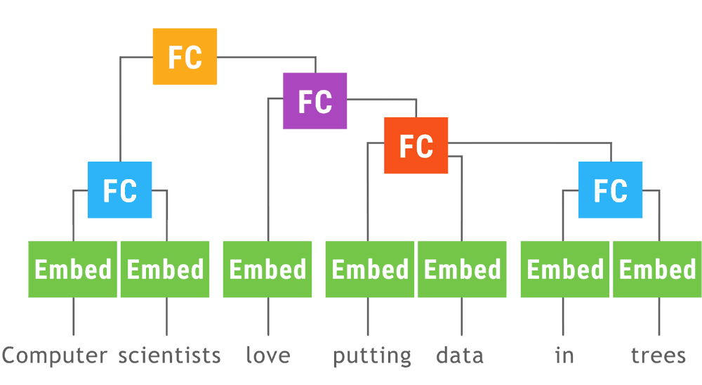

# TensorFlow Fold

TensorFlow Fold is a library for
creating [TensorFlow](https://www.tensorflow.org) models that consume structured
data, where the structure of the computation graph depends on the structure of
the input data. For example, [this model](tensorflow_fold/g3doc/sentiment.ipynb)
implements [TreeLSTMs](https://arxiv.org/abs/1503.00075) for sentiment analysis
on parse trees of arbitrary shape/size/depth.

Fold implements [*dynamic batching*](https://arxiv.org/abs/1702.02181).
Batches of arbitrarily shaped computation graphs are transformed to produce a
static computation graph. This graph has the same structure regardless of what
input it receives, and can be executed efficiently by TensorFlow.

* [Download and Setup](tensorflow_fold/g3doc/setup.md)
* [Quick Start Notebook](tensorflow_fold/g3doc/quick.ipynb)
* [Documentation](tensorflow_fold/g3doc/index.md)

  

This animation shows a [recursive neural network](https://en.wikipedia.org/wiki/Recursive_neural_network) run with dynamic batching. Operations of the same type appearing at the same depth in the computation graph (indicated by color in the animiation) are batched together regardless of whether or not they appear in the same parse tree. The [Embed](tensorflow_fold/g3doc/py/td.md#td.Embedding) operation converts [words to vector representations](https://www.tensorflow.org/tutorials/word2vec/). The fully connected ([FC](tensorflow_fold/g3doc/py/td.md#td.FC)) operation combines word vectors to form vector representations of phrases. The output of the network is a vector representation of an entire sentence.  Although only a single parse tree of a sentence is shown, the same network can run, and batch together operations, over multiple parse trees of arbitrary shapes and sizes. The TensorFlow `concat`, `while_loop`, and `gather` ops are created once, prior to variable initialization, by [Loom](tensorflow_fold/g3doc/py/loom.md), the low-level API for TensorFlow Fold.

If you'd like to contribute to TensorFlow Fold, please review the
[contribution guidelines](CONTRIBUTING.md).
  
TensorFlow Fold is not an official Google product.
