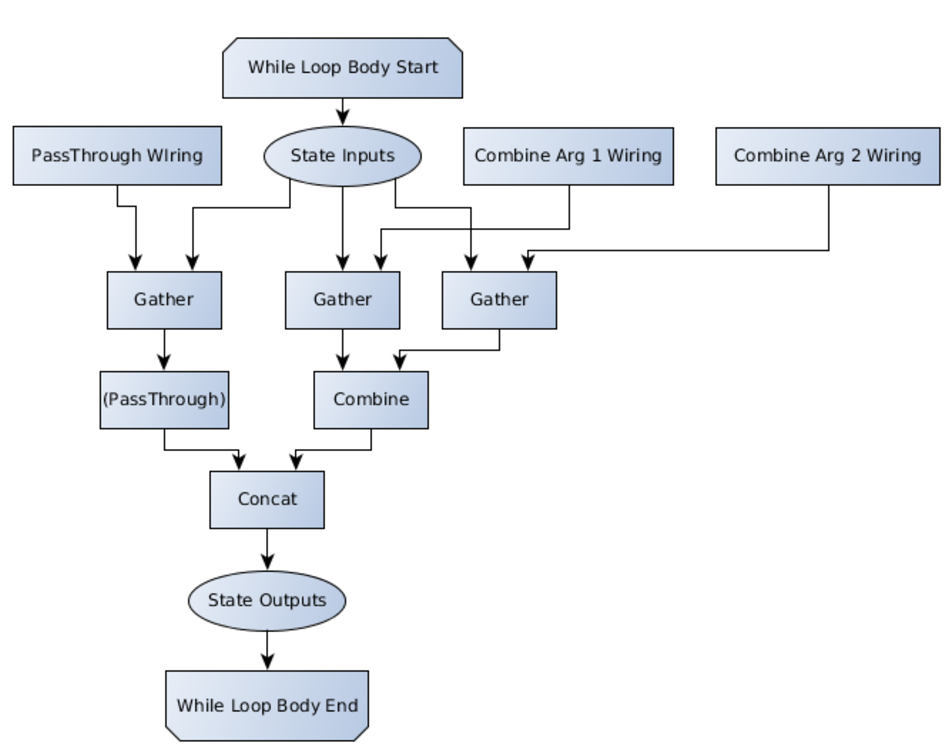

<!-- This file is machine generated: DO NOT EDIT! -->

# TensorFlow Fold Python Loom API
<!-- START doctoc generated TOC please keep comment here to allow auto update -->
<!-- DON'T EDIT THIS SECTION, INSTEAD RE-RUN doctoc TO UPDATE -->


- [`module tensorflow_fold.public.loom` (`loom`)](#module-tensorflow_foldpublicloom-loom)
  - [`class loom.TypeShape`](#class-loomtypeshape)
  - [`class loom.LoomOp`](#class-loomloomop)
  - [`class loom.PassThroughLoomOp`](#class-loompassthroughloomop)
  - [`class loom.Loom`](#class-loomloom)
  - [`class loom.Weaver`](#class-loomweaver)

<!-- END doctoc generated TOC please keep comment here to allow auto update -->

- - -
## `module tensorflow_fold.public.loom` (`loom`)
This is the low-level Loom API for [TensorFlow Fold](../index.md).

As a simple example here's a loom that lets you evaluate arbitrary trees of
element-wise adds and multiplies on floating point vectors of length 3.

```python
class BinaryLoomOp(loom.LoomOp):

  def __init__(self, type_shape, op):
    self._op = op
    super(BinaryLoomOp, self).__init__(
      [type_shape, type_shape], [type_shape])

  def instantiate_batch(self, inputs):
    return [self._op(inputs[0], inputs[1])]

# Set up some loom ops:

x_var = tf.Variable(tf.zeros(3, dtype='float64'), name='x')
y_var = tf.Variable(tf.zeros(3, dtype='float64'), name='y')
vec_3 = loom.TypeShape('float64', (3,))
vec_loom = loom.Loom(
  named_tensors={'x': x_var, 'y': y_var},
  named_ops={'add': BinaryLoomOp(vec_3, tf.add),
             'mul': BinaryLoomOp(vec_3, tf.mul)})

vec_3_out = vec_loom.output_tensor(vec_3)

loss = tf.nn.l2_loss(vec_3_out)

# Then, when parsing a particular example we can do something like:
with tf.Session() as sess:
  sess.run(tf.global_variables_initializer())
  # Loop over examples (the expression we build should depend on the example but
  # for simplicity we'll just build x + [1, 5, 8])
  weaver = vec_loom.make_weaver()
  x = weaver.x
  c = weaver(np.array([1, 5, 8], dtype='float64'))
  x_plus_c = weaver.add(x, c)
  # In this case vec_3_out will contain a 1x3 matrix whose rows is x+c
  print("loss=", loss.eval(feed_dict=weaver.build_feed_dict([x_plus_c])))

  # Note: you could also evaluate multiple expressions at once. For example:
  weaver = vec_loom.make_weaver()
  x = weaver.x
  y = weaver.y
  c_squared = weaver.add(weaver.mul(x, x), weaver.mul(y, y))
  x_plus_y = weaver.add(x, y)
  x_plus_y_squared = weaver.mul(x_plus_y, x_plus_y)
  print("loss=", loss.eval(
      feed_dict=weaver.build_feed_dict([c_squared, x_plus_y_squared])))
  # In this case vec_3_out will contain a 2x3 matrix whose rows are x^2+y^2 and
  # (x+y)^2 (with multiplication being component-wise.)
```

- - -

<a name="loom.TypeShape"></a>
### `class loom.TypeShape`

A type and shape defining a kind of tensor.

TypeShapes are used to specify the argument types and return types of
operations on the emulated graph.

##### Attributes:


*  <b>`dtype`</b>: What type the cells of the tensor should have. Should be a
    `tf.DType`, or stringified version thereof (e.g. 'int64').
*  <b>`shape`</b>: A tuple of integers for the shape of the tensor.
*  <b>`tag`</b>: A name for the type.  Two TypeShapes with the same dtype and
    shape, but with different names, will be treated as different types.


- - -

<a name="loom.TypeShape.dtype_enum"></a>
#### `loom.TypeShape.dtype_enum`

The dtype of this TypeShape as an enum.


- - -

<a name="loom.TypeShape.tensor_flow_name"></a>
#### `loom.TypeShape.tensor_flow_name()`

Makes a name for the TypeShape usable as a TF op name.


- - -

<a name="loom.LoomOp"></a>
### `class loom.LoomOp`

Class to be subclassed for defining Loom operations.
- - -

<a name="loom.LoomOp.__init__"></a>
#### `loom.LoomOp.__init__(input_type_shapes, output_type_shapes)`

Setup the input and output typeshapes for the LoomOp, with checking.


- - -

<a name="loom.LoomOp.input_type_shapes"></a>
#### `loom.LoomOp.input_type_shapes`

A list of TypeShapes of the arguments to this LoomOp.


- - -

<a name="loom.LoomOp.instantiate_batch"></a>
#### `loom.LoomOp.instantiate_batch(inputs)`

Instantiate the TensorFlow ops for running this loom Op.

##### Args:


*  <b>`inputs`</b>: The types of the inputs should match up with the types
    of the input_type_shapes. The shapes of the inputs should also match
    with the shapes of the TypeShapes with one additional dimension at the
    start for the batch size.

##### Returns:

  A list of TensorFlow objects which will contain tensors whose dimensions
  match up with those of the corresponding output_type_shapes (with an
  additional dimension at the start for the batch size as before.)


- - -

<a name="loom.LoomOp.output_type_shapes"></a>
#### `loom.LoomOp.output_type_shapes`

A list of TypeShapes of the return values of this LoomOp.


- - -

<a name="loom.PassThroughLoomOp"></a>
### `class loom.PassThroughLoomOp`

Op which leaves its input alone.

This Op exists to allow Loom objects to pass values to higher depths.

For example, suppose we wanted to run an expression like "(a+b)+c" where a, b,
and c are constants which have depth 0. The first "+" would take place at
depth 1, and the second "+" would take place at depth 2. However, "(a+b)" is
now a level above "c". To fix this, c needs to be passed through depth 1
so it can be an argument to the second "+" at depth 2.
- - -

<a name="loom.PassThroughLoomOp.__init__"></a>
#### `loom.PassThroughLoomOp.__init__(type_shape)`


- - -

<a name="loom.Loom"></a>
### `class loom.Loom`

A Loom lets TensorFlow quickly run dynamic graphs, with back-prop.

A Loom builds a TensorFlow graph which can be made to emulate any
graph made from the `LoomOps` passed in via the `named_ops` argument, tensors
passed in via the `named_tensors`, and constants (created at runtime, along
with the graphs the Loom is to emulate.)

After creating a Loom object (see `Loom.__init__`), you can connect its
outputs to a larger TensorFlow graph by getting its `output_tensor` to get the
batch tensor containing all outputs of a certain shape from Loom, and then
call arbitrary further TensorFlow ops on that (Loom is also fully compatible
with gradients privided the LoomOps it was constructed with are.)

At runtime, you can construct an emulated graph by calling the
`Loom.make_weaver` method and using the resulting Weaver object's API to
build up a graph. To run the emulated graph you can then call the Weaver's
build_feed_dict method to get a dictionary that can be passed to
TensorFlow's `Tensor.eval` or `Session.run` methods.

##### Batch input mode

  In batch input mode, Loom reads inputs from a batched input tensor (which
  will contain a batch of elements of the appropriate TypeShape) instead of
  from constants passed in via Weaver.  The main advantage is that is that
  inputs fed in via batch input mode can be backpropagated through, unlike
  constants.  Batch input mode can be turned on on a per TypeShape basis,
  given a tensor which will contain a batch of elements of the right
  TypeShape.  If a TypeShape is put into batch input mode, then, when using
  the Weaver, instead of manually declaring constants you can simply refer to
  elemements of the batch by index.  Additional advantages of using batch
  input mode are that bulky constants need not bloat the weaver messages and
  they may be changed at runtime.

##### Bypass modes

  Loom can bypass python graph specification should it become a bottle-neck.
  If the `Loom` is constructed with an `input_tensor`, that input tensor
  should contain serialized `WeaverMessages` (which specify a graph or
  schedule for the `Loom` to execute.  See loom.proto for the definition.)
  This `input_tensor` might, for example, read pre-computed `WeaverMessages`
  from a TF-Record file, or pull them from a Tensorflow queue (which would
  allow the computation of schedules to be parallelized across multiple
  processes.)

  Alternatively, if you want all scheduling to happen at runtime in C++ you
  can subclass `WeaverOpBase` (see `weaver_op_base.h`).  The Loom's
  constructor should then be given a `weaver_op`, a function which will be
  passed Loom's metadata and instantiate the user's custom op.

##### `direct_feed_dict` mode
  Loom can also be run in direct_feed_dict mode.  This bypasses
  DeserializingWeaverOp (a TensorFlow op which turns serialized
  `WeaverMessages` in a string tensor into the sorts of tensors that can drive
  the Loom), copying constant tensors directly into the feed_dict, and
  extracting the wiring vectors directly into the feed_dict.  This mode is
  useful for evaluating the cost of DeserializingWeaverOp.  `direct_feed_dict`
  mode is not compatible with the bypass modes above because it avoids putting
  any of its schedules into a string tensor as a `WeaverMessage` entirely.

##### Implementation details

  

  A Loom object wraps a sequence of loom layers each of which can be directed
  to perform a variety of operations. In order to carry a variety of types at
  runtime, the connections from one loom layer to the next include one state
  Tensor containing a batch of values of each supported TypeShape. (E.g. if
  float32 vectors of length 3 are supported, there will be a float32 Tensor
  with dimensions (*, 3) to carry 3-vectors from each layer to the next.)

  Each layer has three sub-layers: (1) an input demultiplexer that extracts
  arguments from the input state tensors and routes them to sub-layer 2 (using
  tf.gather.)  (See weaver.h for the scheduling code that transforms a graph
  of loom operations into lists of indices for these gather ops.) (2) a
  collection of TensorFlow subnetworks, one for each operation type supported
  by the Loom.  These are instantiated with LoomOp.instantiate_batch using the
  inputs from sub-layer 1.  (3) an output multiplexer that combines the
  outputs of the LoomOps (using tf.concat) to form the state tensors to be
  passed on to sub-layer 1 of the next Unit.

  (See `Loom._construct_loom_layer` for the implementation.)

  By default, `max_depth` is unspecified and Loom wraps a single loom layer in
  a `tf.while_loop`.  If max_depth is specified, loom unrolls the loop by
  instantiating `max_depth` copies the loom layer.
- - -

<a name="loom.Loom.__init__"></a>
#### `loom.Loom.__init__(max_depth=None, named_tensors=None, named_ops=None, batch_inputs=None, extra_type_shapes=None, dry_run=False, parallel_iterations=None, back_prop=None, swap_memory=None, direct_feed_dict=False, loom_input_tensor=None, weaver_op=None)`

Constructs a Loom.

While this constructor has many arguments, the only arguments most users
will care about are `named_ops`, `named_tensors`, `dry_run`,
`loom_input_tensor` and possibly `weaver_op`.

To create a Loom object, the only mandatory argument is `named_ops` (a
dictionary mapping strings to `LoomOps`) specifying the collection of
operations the Loom should support.

Specifiying `named_tensors` allows the `Loom` to construct graphs that refer
to the provided TensorFlow tensors.  The advantage of using a named tensor
instead of a Loom constant is that the named tensor can be backpropped
through.

Specifying `loom_input_tensor` causes the `Loom` to read its schedules
(`WeaverMessages`) from external sources.  Specifying `weaver_op` allows
`Loom` to compute them on the fly in C++.  See the class docstring section
named "Bypass Modes" for the motivation for this feature.

Specifying `dry_run` creates the Loom without constructing the associated
TensorFlow graph.  This is useful when the loom is only going to be used to
construct `WeaverMessages` to drive another instance of the same loom.

##### Args:


*  <b>`max_depth`</b>: An optional integer depth to unroll the generic network to.  If
    absent, Loom uses a `tf.while_loop`.  `max_depth` is provided for
    compatibility with old versions of TensorFlow with bad support for
    `tf.while_loop` and for debugging purposes.
*  <b>`named_tensors`</b>: An optional dictionary mapping strings to Tensors. (Named
    tensors are effectively zero argument LoomOps.)  Each value of
    `named_tensors` must be either a tf.Tensor or a tuple of the form
    (tf.Tensor, str) with the string specifying a TypeShape tag.
*  <b>`named_ops`</b>: A mandatory dictionary mapping strings to LoomOp objects (the
    set of operations the Loom should support.)
*  <b>`batch_inputs`</b>: An optional dictionary mapping TypeShapes to Tensors.  Each
    Tensor in the dictionary should have the type and shape to contain a
    batch of things of that TypeShape stacked along dimension 0.
*  <b>`extra_type_shapes`</b>: An optional iterable containing extra TypeShapes that
    may not be inputs or outputs of LoomOps but that the Loom should support
    anyway.
*  <b>`dry_run`</b>: Boolean. If true, don't build the TensorFlow graph (and make the
    output tensors be dummy constants.)  This is useful for rapid testing in
    situtions where building the TensorFlow graph is expensive (eg. large
    max_depth) or when the objective is to construct schedules and serialize
    them as `WeaverMessages` for later use.
*  <b>`parallel_iterations`</b>: Integer. tf.while_loop's parallel_iterations option,
    which caps the number of different depths at which ops could run in
    parallel.  Only applies when max_depth=None. Default: 10.
*  <b>`back_prop`</b>: Boolean. tf.while_loop's back_prop option, which enables
    gradients. Only applies when max_depth=None.  Default: True.
*  <b>`swap_memory`</b>: Boolean. Whether to use tf.while_loop's swap_memory option,
    which enables swapping memory between GPU and CPU at the possible
    expense of some performance. Only applies when max_depth=None. Default:
    False.
*  <b>`direct_feed_dict`</b>: Boolean. If true, this loom doesn't create a loom_input
    tensor for WeaverMessages, and instead creates placeholders for the
    wiring diagrams. Default: False.
*  <b>`loom_input_tensor`</b>: An optional string Tensor from which to read
    WeaverMessages which specify how to wire the loom.  If more than one is
    present they will be merged (auto-merge is provided so that
    WeaverMessages for individual inputs can be cached in advance while
    still using random mini-batches at run-time.)  Mutally exclusive with
    `weaver_op`.
*  <b>`weaver_op`</b>: An optional callable which constructs a TensorFlow op to
    produce inputs for the loom.  Mutually exclusive with
    `loom_input_tensor`.  If absent, the loom acts as though `weaver_op`
    were a function creating a `deserializing_weaver` op which consumes
    `WeaverMessages` from `loom_input_tensor`.  The callable will be called
    with three keyword arguments named `metadata`, `constant_types`, and
    `num_type_shapes` (because these are the three attributes any op
    descending from `WeaverOpBase` requires to be instantiated.)

##### Raises:


*  <b>`TypeError`</b>: If `named_ops` is not provided.
*  <b>`TypeError`</b>: If more than one tagged TypeShape has the same tag.


- - -

<a name="loom.Loom.deserialize_weaver"></a>
#### `loom.Loom.deserialize_weaver(serialized_weaver)`

Turn a serialized `WeaverMessage` proto into an Python Weaver object.


- - -

<a name="loom.Loom.input_tensor"></a>
#### `loom.Loom.input_tensor`

The input tensor for this loom.

##### Returns:

  The Loom's input tensor.


*  <b>`Raises`</b>: TypeError if `direct_feed_dict` mode was enabled when the loom was
  constructed.


- - -

<a name="loom.Loom.make_weaver"></a>
#### `loom.Loom.make_weaver()`

Constructs a Weaver object for the current loom.


- - -

<a name="loom.Loom.output_tensor"></a>
#### `loom.Loom.output_tensor(type_shape)`

Return the output Tensor for the given TypeShape.

##### Returns:

  An output Tensor has one more dimension than the type_shape (the first
  dimension is the one along which all the values of that TypeShape have
  been concatenated. For example if the TypeShape were `('float32', (3, 5))`
  we'd return a `float32` tensor whose dimensions are `(*, 3, 5)` where the
  `*` can be any number. The Tensor will contains a batch of all 3x5 matrix
  results passed to Weaver's `build_feed_dict`.

##### Args:


*  <b>`type_shape`</b>: The TypeShape we want to look up.


- - -

<a name="loom.Loom.type_shapes"></a>
#### `loom.Loom.type_shapes`

The list of TypeShapes used by this loom.


- - -

<a name="loom.Weaver"></a>
### `class loom.Weaver`

A (partially constructed) wiring diagram or schedule for a Loom object.

This object is a user-friendly wrapper for the `tensorflow::fold::Weaver` C++
object.

The `build_feed_dict` method uses the Weaver to construct a dict directing the
Loom to behave like the diagram.

Alternatively, the user can call the `serialize` method to serialize the
schedule to a string in order to eventually pass it into a Loom's
`input_tensor`.
- - -

<a name="loom.Weaver.__init__"></a>
#### `loom.Weaver.__init__(loom)`

Sets up the Weaver Object.

##### Args:


*  <b>`loom`</b>: The Loom object backing this Weaver.

##### Raises:


*  <b>`TypeError`</b>: If loom is not a Loom object.
*  <b>`AssertionError`</b>: If the Weaver object cannot be constructed or if any of
    its named tensors cannot be retrieved.


- - -

<a name="loom.Weaver.add_output"></a>
#### `loom.Weaver.add_output(result)`

Mark 'result' as an output of the loom.


- - -

<a name="loom.Weaver.batch_input"></a>
#### `loom.Weaver.batch_input(type_shape, batch_idx)`

Return a LoomResult which stands for en element of a batch_input tensor.

##### Args:


*  <b>`type_shape`</b>: Which typeshape the input is from.
*  <b>`batch_idx`</b>: Which element of the batch this input is.

##### Returns:

  A LoomResult which stands for an element of a batch_input tensor.

##### Raises:


*  <b>`TypeError`</b>: Raised if `type_shape` is not a recognized TypeShape.
*  <b>`AssertionError`</b>: If an internal error occurs in creating the batch input.


- - -

<a name="loom.Weaver.build_feed_dict"></a>
#### `loom.Weaver.build_feed_dict(outputs=None)`

Turn this diagram into a dictionary for feed_dict.

Warning: No changes made to this Weaver will be reflected in the
results of `build_feed_dict` after the first time it is called
because `build_feed_dict` calls `Weaver::Finalize`, which freezes
the Weaver's output wirings.

##### Returns:

  A dictionary which can be passed as a `feed_dict` argument to
  `tf.Session.run()` which will cause this Weaver's Loom to behave like
  the diagram.

##### Args:


*  <b>`outputs`</b>: Additional nodes which should be sent to the output tensors
    (these can also be set using `add_output`.)


- - -

<a name="loom.Weaver.constant"></a>
#### `loom.Weaver.constant(value, tag='')`

Return a LoomResult which stands in a constant value.

##### Args:


*  <b>`value`</b>: A NumPy object containing the constant.
*  <b>`tag`</b>: What tag the value's TypeShape ought to have.

##### Returns:

  A LoomResult which stands for a constant value.

##### Raises:


*  <b>`TypeError`</b>: Raised if the constant does not have one of the TypeShapes
    supported by the loom.
*  <b>`AssertionError`</b>: If an internal error occurs in creating the constant.


- - -

<a name="loom.Weaver.deepest"></a>
#### `loom.Weaver.deepest`

The maximum depth of any LoomResult created by this input.


- - -

<a name="loom.Weaver.depth"></a>
#### `loom.Weaver.depth(result)`

Returns the depth of a given itermediate loom result.

Constants have depth `0`, and (the outputs of) loom ops whose arguments
have maximum depth `n-1` have depth `n`

##### Args:


*  <b>`result`</b>: A loom result whose depth is to be calculated.

##### Returns:

  The depth of the result.


- - -

<a name="loom.Weaver.get_type_shape"></a>
#### `loom.Weaver.get_type_shape(result)`

Returns the TypeShape of the tensor represented by `result`.


- - -

<a name="loom.Weaver.named_tensor"></a>
#### `loom.Weaver.named_tensor(name)`

Return a LoomResult which stands in for the named Tensor input.


- - -

<a name="loom.Weaver.op"></a>
#### `loom.Weaver.op(op_name, args)`

Creates a LoomResult representing the invocation of a LoomOp.

##### Args:


*  <b>`op_name`</b>: Which operation to call.
*  <b>`args`</b>: A list of LoomResult objects representing the arguments of the op.

##### Returns:

  A list of loom result objects.

##### Raises:


*  <b>`KeyError`</b>: Raised if op_name is not the name of a LoomOp for this Loom.
*  <b>`TypeError`</b>: Raised if any of 'args' is not an integer.
*  <b>`AssertionError`</b>: If an internal error occurs calling the op.  Raised if the
    LoomResult arguments are of the wrong TypeShape or if the user attempts
    to create a graph deeper than the Loom's max_depth.


- - -

<a name="loom.Weaver.serialize"></a>
#### `loom.Weaver.serialize()`

Turn this Weaver into a serialized `WeaverMessage` proto.

##### Returns:

  A string (the serialization of the Weaver.)

##### Raises:


*  <b>`AssertionError`</b>: if the serialization fails.


